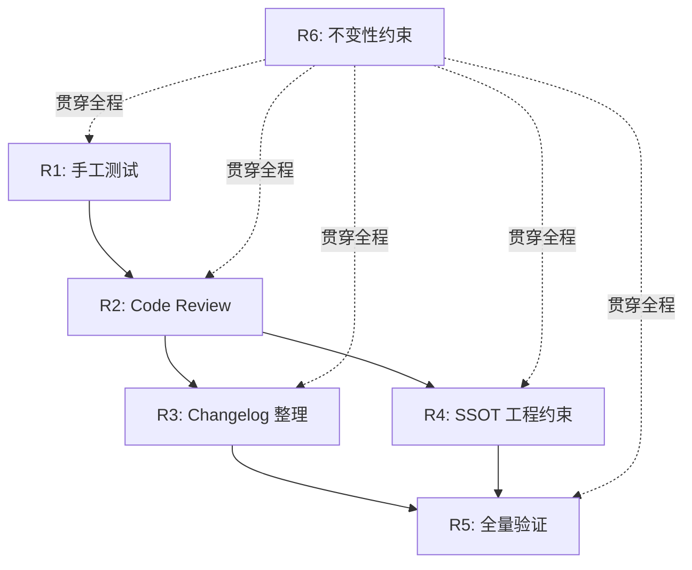

# Design Document: Release 2.0.0

## Overview

本设计文档描述 `oasis/utils` v2.0.0 release 的执行方案。

本次 release 仅包含一个 feature：`upgrade-to-php8`（PRP-001），将项目从 PHP 7.4 + PHPUnit 5.x 升级到 PHP >=8.2 + PHPUnit 11.x。Feature 的代码变更已全部完成并通过全量测试（318 tests, 2373 assertions，无 deprecation 警告），但 Task 11（手工测试）和 Task 12（Code Review）尚未执行。

- Feature spec：`.kiro/specs/upgrade-to-php8/`
- Proposal：`docs/proposals/PRP-001-upgrade-to-php8.md`
- Feature design：`.kiro/specs/upgrade-to-php8/design.md`

Requirements 中的已知 Issue 评估确认无需修复的 issue（项目级和 release 系列均无），本 design 不包含 issue 修复方案。

Release 工作分为两个阶段：

1. **Feature 遗留验证**：完成手工测试（R1）和 Code Review（R2），确认升级质量
2. **Release 收尾**：changelog 整理（R3）、SSOT 工程约束更新（R4）、全量验证（R5），全程遵守 API 不变性约束（R6）

核心原则：**本次 release 不修改 `src/`、`ut/`、`phpunit.xml`、`composer.lock`**。所有变更限于 `docs/` 目录下的文档文件。

---

## Architecture

本次 release 不改变项目架构。现有模块结构保持不变：

```
src/                  # 源代码（不修改）
src/Exceptions/       # 自定义异常类（不修改）
src/Validators/       # 数据验证器（不修改）
ut/                   # 单元测试（不修改）
docs/                 # 文档分层目录（本次变更范围）
```

变更仅限于：
- `docs/changes/` 下的 changelog 文件创建与整理
- `docs/state/` 下新建 `engineering.md`

---

## Components and Interfaces

### 1. 手工测试验证（R1）

手工测试验证 upgrade-to-php8 feature 的升级质量，共 7 项检查。执行顺序如下：

#### 1.1 运行时环境检查

```bash
php --version
```

验证输出中 PHP 版本号 >= 8.2。

#### 1.2 全量测试

```bash
php vendor/bin/phpunit
```

验证标准：
- 318 tests, 2373 assertions 全部通过
- 零失败、零错误
- 无 PHP deprecation 警告
- 无 PHPUnit deprecation 警告

#### 1.3 CaesarCipherTest 独立运行

```bash
php vendor/bin/phpunit ut/CaesarCipherTest.php
```

验证该文件可作为独立测试文件成功运行（该文件在 upgrade-to-php8 中被加入 phpunit.xml suite）。

#### 1.4 Composer 依赖检查

检查 `composer.json` 中：
- `require` section 包含 `"php": ">=8.2"`
- `require-dev` section 包含 `"phpunit/phpunit": "^11.0"`

#### 1.5 phpunit.xml 格式检查

检查 `phpunit.xml`：
- 包含 `cacheDirectory` 属性
- 不包含 `xmlns:xsi` 属性
- 不包含 `xsi:noNamespaceSchemaLocation` 属性

#### 1.6 .gitignore 检查

检查 `.gitignore` 包含 `.phpunit.cache/` 条目。

#### 1.7 PROJECT.md 检查

检查 `PROJECT.md` 反映：
- PHP 版本 >=8.2
- 测试框架 PHPUnit 11.x
- 测试命令 `php vendor/bin/phpunit`

### 2. Code Review（R2）

委托 `code-reviewer` sub-agent 对 upgrade-to-php8 feature 引入的全部变更执行完整 review。

执行方式：调用 code-reviewer sub-agent，指定 review 范围为 upgrade-to-php8 feature 的变更文件。

如果 code-reviewer 报告问题，须在继续后续 release 工作前解决所有问题。若问题涉及 `src/` 或 `ut/` 的源代码变更，根据 R6 AC4，须向用户升级确认后再执行。

### 3. ~~版本号声明（R3）~~ — 已移除

用户决策：Composer 官方建议不在 `composer.json` 中写 `version` 字段（版本由 VCS tag 决定）。本 requirement 已取消。

### 4. Changelog 整理（R3）

按照 `docs/changes/README.md` 定义的流程整理 changelog。

#### 4.1 创建版本目录

创建 `docs/changes/2.0.0/` 目录。

#### 4.2 创建版本 CHANGELOG.md

创建 `docs/changes/2.0.0/CHANGELOG.md`，格式遵循 `docs/changes/README.md` 中定义的版本 CHANGELOG.md 模板：

```markdown
# Changelog v2.0.0

本文件记录 v2.0.0 release 的变更内容。

---

## 包含的 Feature

### upgrade-to-php8（PRP-001）

将项目从 PHP 7.4 + PHPUnit 5.x 升级到 PHP >=8.2 + PHPUnit ^11.0。

#### Changed

- `composer.json`：添加 `"php": ">=8.2"`，将 `phpunit/phpunit` 从 `^5.1` 升级为 `^11.0`
- `composer.lock`：在 PHP 8.x 环境下重新生成
- `phpunit.xml`：迁移到 PHPUnit 11.x 格式（移除 XSD 属性，添加 `cacheDirectory`）
- 17 个测试文件基类从 `PHPUnit_Framework_TestCase` 替换为 `\PHPUnit\Framework\TestCase`
- 14 个测试文件的 data provider 方法添加 `static` 关键字
- 2 个测试文件的 `setUp()` / `tearDown()` 添加 `: void` 返回类型
- `MlibDataProviderTest.php`：移除 `testNull()` 上的空 `@dataProvider` annotation
- `PROJECT.md`：更新 PHP 版本、测试框架版本和测试命令

#### Added

- `ut/CaesarCipherTest.php` 加入 `phpunit.xml` test suite
- `.gitignore` 添加 `.phpunit.cache/` 条目

#### Fixed

- `StringValidator.php`：修复 `method_exists($target, '__toString()')` 为 `method_exists($target, '__toString')`
- `TrimmedStringValidator.php`：修复 `method_exists($target, '__toString()')` 为 `method_exists($target, '__toString')`

---

## 修复的 Issue

无。

---

## 工程变更

- `docs/state/engineering.md` 新建工程约束文档

---

## 测试覆盖

- 全量测试通过：318 tests, 2373 assertions，无 deprecation 警告
```

#### 4.3 移除 unreleased 文件

删除 `docs/changes/unreleased/upgrade-to-php8.md`。

#### 4.4 全局 CHANGELOG.md

检查 `docs/changes/CHANGELOG.md` 是否存在：
- **不存在**（当前状态）：按 `docs/changes/README.md` 定义的格式创建该文件
- **已存在**：在顶部追加 v2.0.0 摘要条目

全局 CHANGELOG.md 内容：

```markdown
# Changelog

## v2.0.0 - {发布日期}

升级到 PHP >=8.2 + PHPUnit 11.x，放弃 PHP 7.x 向后兼容。详见 [2.0.0/CHANGELOG.md](2.0.0/CHANGELOG.md)。
```

`{发布日期}` 在执行时替换为实际日期（YYYY-MM-DD 格式）。

### 5. SSOT 工程约束更新（R4）

新建 `docs/state/engineering.md`，集中存放项目的工程约束信息。

#### 文件内容

```markdown
# Engineering

本文件描述项目的工程约束与技术选型。

---

## 运行时要求

| 项目 | 约束 |
|------|------|
| PHP | >=8.2 |
| 扩展 | 无强制要求（igbinary 可选，用于 DataPacker 默认序列化） |

---

## 依赖

### 运行时依赖

| 包 | 版本约束 | 用途 |
|----|----------|------|
| `voku/portable-utf8` | ^3.0 | UTF-8 字符串处理（StringUtils、StringLengthValidator） |

### 开发依赖

| 包 | 版本约束 | 用途 |
|----|----------|------|
| `phpunit/phpunit` | ^11.0 | 单元测试框架 |

---

## 包管理

| 项目 | 值 |
|------|-----|
| 包管理器 | Composer |
| 自动加载 | PSR-4（`Oasis\Mlib\Utils\` → `src/`） |
| 包名 | `oasis/utils` |
| 许可证 | MIT |

---

## 测试

| 项目 | 值 |
|------|-----|
| 框架 | PHPUnit 11.x |
| 配置文件 | `phpunit.xml` |
| 测试目录 | `ut/` |
| Bootstrap | `ut/bootstrap.php` |
| 缓存目录 | `.phpunit.cache/`（已加入 `.gitignore`） |
| 全量命令 | `php vendor/bin/phpunit` |
| 单文件命令 | `php vendor/bin/phpunit ut/<TestFile>.php` |
```

#### 约束

- 不修改 `docs/state/` 中任何现有文件（crypto.md、data-provider.md、exceptions.md、utils.md、validators.md）（R4 AC4）
- 仅新建 `engineering.md`

#### docs/state/README.md 更新

在 `docs/state/README.md` 的文件索引表格中追加一行：

| 文件 | 覆盖范围 |
|------|----------|
| `engineering.md` | 工程约束（PHP 版本、依赖、测试框架、包管理） |

### 6. Release 分支全量验证（R5）

在所有 release 工作完成后，执行最终验证清单：

| # | 检查项 | 验证方式 |
|---|--------|----------|
| 1 | 全量测试通过 | `php vendor/bin/phpunit`，零失败、零 deprecation |
| 2 | 版本 changelog 存在 | 检查 `docs/changes/2.0.0/CHANGELOG.md` 存在且包含 upgrade-to-php8 内容 |
| 3 | unreleased 已清理 | 检查 `docs/changes/unreleased/upgrade-to-php8.md` 已被移除 |
| 4 | SSOT 工程约束 | 检查 `docs/state/engineering.md` 存在且包含 PHP >=8.2、PHPUnit 11.x、Composer、voku/portable-utf8 ^3.0 |

全部检查通过后，release 分支可进入合并和打 tag 流程（由 gitflow-finisher 处理）。

### 7. 功能与 API 不变性约束（R6）

贯穿整个 release 过程的约束，不作为独立执行步骤，而是每个步骤的守护条件：

| 约束 | 说明 |
|------|------|
| `src/` 不可修改 | release 过程中不修改任何源文件 |
| `ut/` 不可修改 | release 过程中不修改任何测试文件 |
| `phpunit.xml` 不可修改 | release 过程中不修改测试配置 |
| `composer.lock` 不可修改 | release 过程中不修改依赖锁定文件 |
| 源代码变更需升级确认 | 若 code-reviewer 发现需要源代码变更的问题，须向用户确认后再执行（R6 AC4） |

---

## Data Models

本次 release 不涉及数据模型变更。所有类的属性、方法签名和行为保持不变。

---

## Error Handling

本次 release 不改变错误处理策略。现有异常体系保持不变。

需要处理的异常场景：
- **手工测试失败**：若全量测试未通过或出现 deprecation 警告，须停止 release 流程并排查原因
- **Code Review 发现问题**：若问题涉及源代码变更，须向用户升级确认（R6 AC4）

---

## Testing Strategy

### 测试方法

本次 release 的正确性验证完全依赖**现有测试套件**和**人工检查**。

验证分为两个层次：
1. **自动化验证**：通过 `php vendor/bin/phpunit` 运行全量测试，确认 318 tests / 2373 assertions 全部通过
2. **人工检查**：通过文件内容检查验证文档变更的正确性（changelog 格式、engineering.md 内容）

### 为什么不使用 Property-Based Testing

本次 release 是一个**文档与配置收尾**任务，不引入新的业务逻辑或纯函数。PBT 不适用于以下原因：
- 变更主要是文档文件的创建和整理（changelog、engineering.md）
- 不存在可以用 "for all inputs X, property P(X) holds" 表达的通用性质
- 正确性由现有测试套件的通过和人工文件内容检查来保证

### 验证步骤

1. **手工测试**（R1）：7 项检查，验证 upgrade-to-php8 升级质量
2. **Code Review**（R2）：code-reviewer sub-agent 审查变更
3. **全量验证**（R5）：release 收尾后的最终检查清单

---

## Impact Analysis

### 受影响的文件

| 文件 | 变更类型 | 说明 |
|------|----------|------|
| `docs/changes/2.0.0/CHANGELOG.md` | 新建 | 版本 changelog |
| `docs/changes/CHANGELOG.md` | 新建 | 全局 changelog 索引 |
| `docs/changes/unreleased/upgrade-to-php8.md` | 删除 | 已整理到版本目录 |
| `docs/state/engineering.md` | 新建 | 工程约束 SSOT |
| `docs/state/README.md` | 修改 | 文件索引追加 engineering.md |

### 不受影响的文件

| 范围 | 说明 |
|------|------|
| `src/**` | R6 约束，不修改 |
| `ut/**` | R6 约束，不修改 |
| `phpunit.xml` | R6 约束，不修改 |
| `composer.lock` | R6 约束，不修改 |
| `docs/state/crypto.md` | R4 AC4，不修改现有 state 文件 |
| `docs/state/data-provider.md` | R4 AC4，不修改现有 state 文件 |
| `docs/state/exceptions.md` | R4 AC4，不修改现有 state 文件 |
| `docs/state/utils.md` | R4 AC4，不修改现有 state 文件 |
| `docs/state/validators.md` | R4 AC4，不修改现有 state 文件 |

### 影响维度分析

| 维度 | 影响 |
|------|------|
| State 文档 | `docs/state/README.md` 追加索引行；新建 `docs/state/engineering.md`；现有 5 个 state 文件不受影响 |
| 模块行为变化 | 不涉及——本次 release 不修改源代码或测试代码 |
| 数据模型变更 | 不涉及——无旧数据兼容问题 |
| 外部系统交互 | 不涉及——本项目为独立 PHP 库 |
| 配置项变更 | 不涉及——本次 release 不修改 `composer.json` |

### 执行顺序依赖



- R1 → R2：手工测试通过后才执行 Code Review
- R2 → R3/R4：Code Review 通过后才开始 release 收尾工作
- R3 + R4 → R5：所有收尾工作完成后执行全量验证
- R6：贯穿全程的守护约束

---

## Socratic Review

### Q1: 手工测试的 7 项检查是否完整覆盖了 R1 的全部 AC？

**A:** 是。R1 有 7 条 AC，设计中 §1.1-§1.7 逐一对应：§1.1→AC1（PHP 版本）、§1.2→AC2（全量测试）、§1.3→AC3（CaesarCipherTest 独立运行）、§1.4→AC4（Composer 依赖）、§1.5→AC5（phpunit.xml 格式）、§1.6→AC6（.gitignore）、§1.7→AC7（PROJECT.md）。

### Q2: ~~composer.json 的 version 字段位置是否合理？~~

**A:** 已移除。用户决策不在 `composer.json` 中写 `version` 字段，版本由 VCS tag 决定。

### Q3: changelog 内容是否完整包含了 unreleased 文件中的全部变更条目？

**A:** 是。§4.2 中的版本 CHANGELOG.md 内容完整复制了 `docs/changes/unreleased/upgrade-to-php8.md` 中的 Changed、Added、Fixed 三个 section 的全部条目，并在"工程变更" section 中补充了 release 自身的变更（version 字段和 engineering.md）。

### Q4: engineering.md 的内容范围是否恰当？

**A:** 是。R4 要求包含 PHP 版本（>=8.2）、测试框架（PHPUnit 11.x）、包管理器（Composer）和运行时依赖（voku/portable-utf8 ^3.0）。§5 的 engineering.md 设计覆盖了全部四项，并补充了测试配置信息（测试目录、bootstrap、命令）作为工程约束的自然延伸。未修改任何现有 state 文件（R4 AC4）。

### Q5: R5 全量验证是否覆盖了所有 release 产出？

**A:** 是。R5 有 4 条 AC，§6 的验证清单逐一对应：#1→AC1（全量测试）、#2→AC2（版本 changelog）、#3→AC3（unreleased 清理）、#4→AC4（SSOT 工程约束）。

### Q6: R6 不变性约束的执行方式是否可行？

**A:** 是。R6 设计为贯穿全程的守护约束而非独立步骤，这与其性质一致——它是一组"不做什么"的约束。在 task 执行阶段，每个涉及文件修改的 task 都应检查目标文件是否在 R6 的保护范围内。R6 AC4（源代码变更需升级确认）在 §2 Code Review 中已明确说明处理方式。

### Q7: Requirements Gatekeep Log 中的 CR 决策是否在 design 中得到体现？

**A:** 是。Requirements CR 有 3 个已回答的问题：
- Q1（spec 归档由 gitflow-finisher 处理，不纳入 release spec）→ design 中未包含 spec 归档步骤，与决策一致
- Q2（SSOT 放在新建的 `docs/state/engineering.md`）→ §5 明确新建该文件
- Q3（R5 不需要包含 `composer validate`）→ §6 验证清单中不含 `composer validate`


---

## Gatekeep Log

**校验时间**: 2025-07-15
**校验结果**: ⚠️ 已修正后通过

### 修正项
- [内容] Overview 缺少 feature spec、proposal、feature design 的明确引用路径，已补充三条引用链接
- [内容] 未呼应 requirements 中"已知 Issue 评估"的结论（无 issue 需修复），已在 Overview 中补充说明
- [内容] Impact Analysis 仅有文件级表格，缺少按维度组织的分析（state 文档、行为变化、数据模型、外部系统、配置项变更），已补充"影响维度分析"表格
- [内容] Socratic Review 缺少对 requirements CR 决策在 design 中体现的检查，已补充 Q7

### 合规检查
- [x] 无 TBD / TODO / 待定 / 占位符
- [x] 无空 section 或不完整的列表
- [x] 内部引用一致（R1-R6 编号与 requirements.md 一致）
- [x] 代码块语法正确（bash、json、markdown、mermaid 均有语言标注且闭合）
- [x] 无 markdown 格式错误
- [x] 一级标题存在且正确
- [x] 技术方案主体存在（§1-§7），承接了 requirements 中全部 7 条 requirement
- [x] 各 section 之间使用 `---` 分隔
- [x] 每条 requirement 在 design 中都有对应的实现描述（R1→§1, R2→§2, R3→§4, R4→§5, R5→§6, R6→§7）
- [x] 无遗漏的 requirement（§3 已按用户决策标记移除）
- [x] design 中的方案不超出 requirements 的范围
- [x] Impact Analysis 覆盖全部必要维度（state 文档、行为变化、数据模型、外部系统、配置项变更）
- [x] 技术选型有明确理由（version 字段位置引用 Composer 官方文档、PBT 不适用理由充分）
- [x] 无过度设计
- [x] 与 state 文档中描述的现有架构一致
- [x] Socratic Review 覆盖充分（7 个 Q&A）
- [x] Requirements CR 决策全部体现在 design 中（Q1→无 spec 归档、Q2→engineering.md、Q3→R5 不含 composer validate）
- [x] 技术选型明确，无含糊选型
- [x] 可 task 化——执行顺序依赖图清晰，模块间关系明确
- [x] Release spec 必要内容：技术摘要汇总（Overview）、Issue 修复方案（无 issue，已说明）、测试策略（Testing Strategy）、收敛计划（§4-§5 + §6）

### Clarification Round

**状态**: 已完成

**Q1:** Design 中 R3（Changelog 整理）§4.2 的版本 CHANGELOG.md 在 feature 标题下使用了 Changed/Added/Fixed 分类子标题（`####`），这比 `docs/changes/README.md` 模板中的简单列表格式更详细。Tasks 阶段创建该文件时，应使用哪种格式？
- A) 保持 design 中的分类格式（Changed/Added/Fixed 子标题），与 unreleased 文件的分类方式一致
- B) 简化为 README.md 模板中的纯列表格式（不分类，直接列变更点）
- C) 其他（请说明）

**A:** B

**Q2:** Design 中 R3 和 R4 在执行顺序图中标注为可并行执行（R2 → R3/R4）。Tasks 阶段是否将它们拆为独立的并行 task，还是按顺序串行执行？
- A) 拆为独立 task，允许并行执行（R3 和 R4 无数据依赖）
- B) 按 R3 → R4 顺序串行执行，降低复杂度
- C) 按 R4 → R3 顺序串行执行（先更新 SSOT，再整理 changelog，因为 changelog 的"工程变更" section 引用了 engineering.md）
- D) 其他（请说明）

**A:** A

**Q3:** Design §5 中 `docs/state/README.md` 的更新（追加 engineering.md 索引行）是作为 R4 SSOT 更新 task 的一部分，还是作为独立 task？
- A) 作为 R4 task 的一部分（创建 engineering.md 和更新 README.md 索引在同一个 task 中完成）
- B) 作为独立 task（先创建 engineering.md，再单独更新 README.md 索引）
- C) 其他（请说明）

**A:** A
